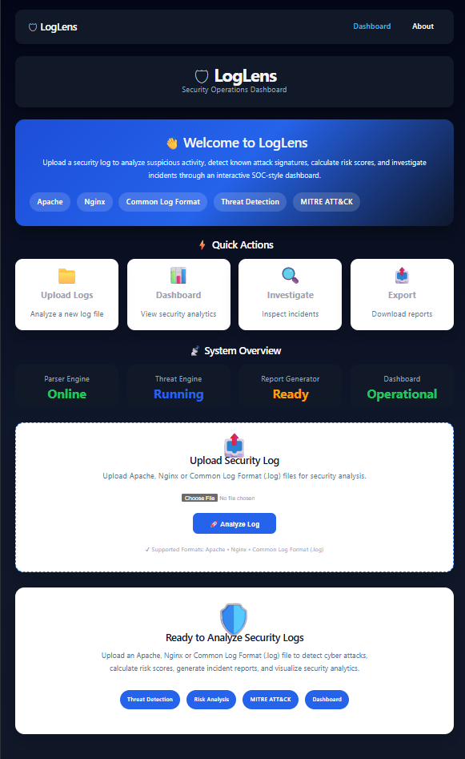
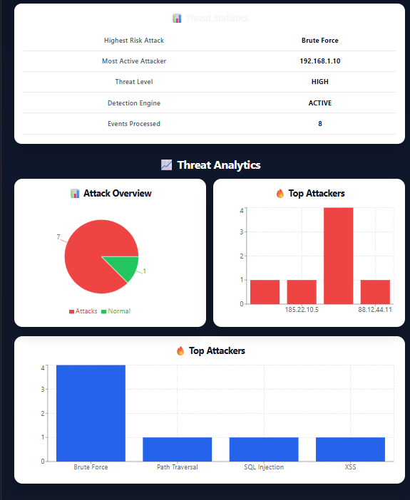
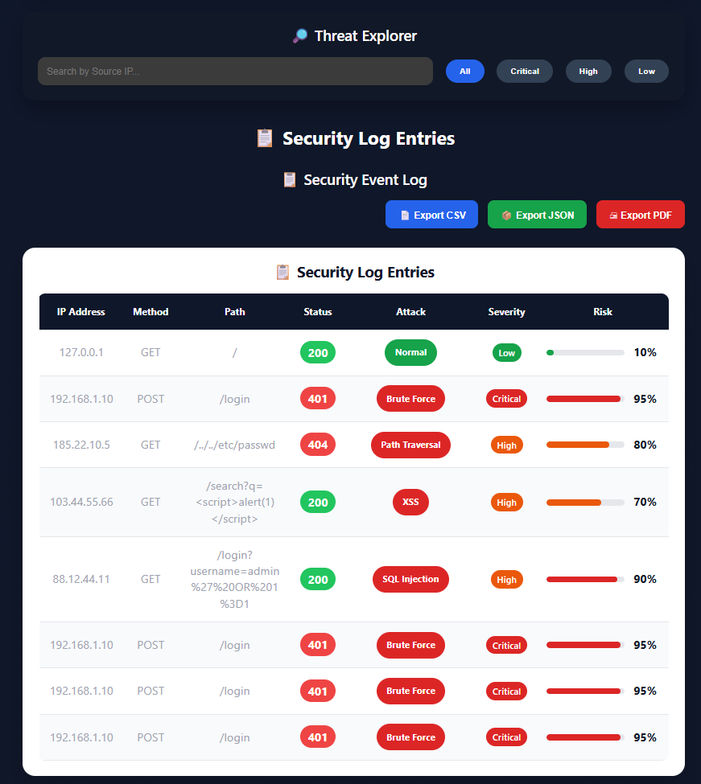
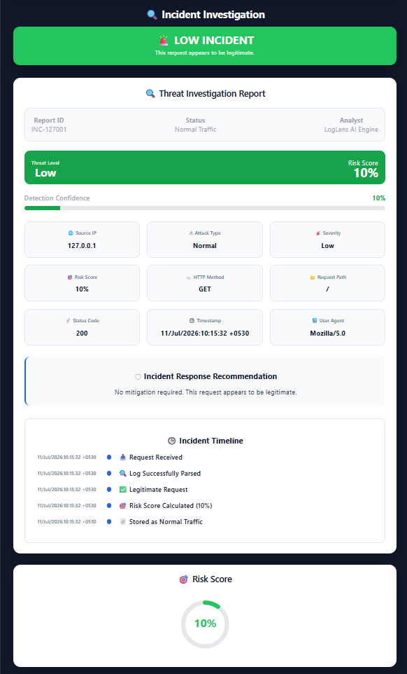
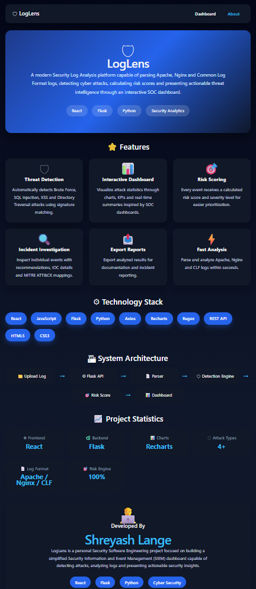

# 🛡️ LogLens

<p align="center">


# Security Log Analysis Platform

### AI-Inspired Security Log Analysis Dashboard

Detect • Analyze • Investigate • Report

Built using **React**, **Flask**, **Python**, and **Recharts**

---

[]()
[]()
[]()
[]()
[]()
[]()

</p>

---

# 🌐 Live Demo

### Frontend (Vercel)

🔗 https://loglens-security.vercel.app

### Backend API (Railway)

🔗 https://loglens-production.up.railway.app

---

# 📖 Overview

LogLens is a lightweight Security Information and Event Management (SIEM)-inspired web application designed to analyze Apache, Nginx, and Common Log Format (CLF) web server logs.

The platform automatically parses uploaded log files, detects common cyber attacks using a signature-based detection engine, calculates risk scores, classifies severity levels, generates executive security summaries, visualizes security analytics, and exports professional investigation reports.

LogLens was developed as a cybersecurity portfolio project inspired by modern Security Operations Centers (SOC) and enterprise SIEM platforms such as:

- Splunk
- Wazuh
- Elastic Security
- Microsoft Sentinel

---

# ✨ Key Features

| Module | Description |
|---------|-------------|
| 📄 Log Parser | Apache, Nginx & CLF Log Parsing |
| 🚨 Threat Detection | SQL Injection, XSS, Brute Force, Path Traversal |
| 🎯 Risk Scoring | Calculates risk score (0–100) |
| 🛡 Threat Confidence | Confidence percentage for detections |
| 📊 Executive Dashboard | Security summary cards |
| 📈 Threat Analytics | Interactive charts using Recharts |
| 🌍 Top Attackers | IP Intelligence |
| 🔍 Incident Investigation | Complete IOC Analysis |
| 🧠 MITRE Mapping | MITRE ATT&CK references |
| 📋 Analyst Recommendations | Incident response suggestions |
| 📄 PDF Reports | Professional investigation reports |
| 📂 CSV Export | Export parsed logs |
| 🗂 JSON Export | Export complete investigation |

---

# 🏗️ System Architecture

```

                    User

│

▼

React Frontend (Vercel)

│

Axios REST API

│

▼

Flask Backend (Railway)

│

├── Parser Engine

├── Threat Detector

├── Risk Calculator

├── Report Generator

└── Summary Engine

│

▼

Security Dashboard

```

---

# 🛠️ Technology Stack

| Layer | Technology |
|--------|------------|
| Frontend | React |
| Backend | Flask |
| Language | Python |
| Charts | Recharts |
| HTTP Client | Axios |
| Styling | CSS |
| Deployment | Vercel + Railway |

### Python Libraries

- Flask
- Flask-CORS
- Werkzeug
- dotenv

### Frontend Libraries

- Axios
- Recharts
- React Icons
- jsPDF
- html2canvas

---

# 📂 Project Structure

```text
LogLens
│
├── app
│   ├── services
│   │   ├── parser.py
│   │   ├── detector.py
│   │   └── upload_service.py
│   │
│   ├── templates
│   ├── routes.py
│   └── __init__.py
│
├── frontend
│   ├── src
│   │   ├── components
│   │   ├── pages
│   │   ├── data
│   │   ├── services
│   │   └── assets
│
├── demo_logs
│   ├── clean_demo.log
│   └── attack_demo.log
│
├── uploads
├── screenshots
├── config.py
├── run.py
├── requirements.txt
└── README.md

```

---

# 🚀 Installation

## Clone the Repository

```bash
git clone https://github.com/shreyashlange2006/LogLens.git

cd LogLens
```

---

# ⚙ Backend Setup

## Create Virtual Environment

Windows

```bash
python -m venv venv
```

Activate

```bash
venv\Scripts\activate
```

Install Dependencies

```bash
pip install -r requirements.txt
```

Run Backend

```bash
python run.py
```

Flask will start on

```
http://127.0.0.1:5000
```

---

# 💻 Frontend Setup

Open another terminal

```bash
cd frontend
```

Install Packages

```bash
npm install
```

Run Development Server

```bash
npm run dev
```

Frontend runs at

```
http://localhost:5173
```

---

# 🌍 Deployment

## Frontend

Hosted using **Vercel**

```
https://loglens-security.vercel.app
```

---

## Backend

Hosted using **Railway**

```
https://loglens-production.up.railway.app
```

---

# 📤 Upload Supported Log Formats

LogLens currently supports

- Apache Access Logs
- Nginx Access Logs
- Common Log Format (CLF)

Example

```log
127.0.0.1 - - [11/Jul/2026:10:15:32 +0530] "GET / HTTP/1.1" 200 1024 "-" "Mozilla/5.0"
```

---

# 🧠 Threat Detection Engine

LogLens currently detects

| Attack | Severity | Risk Score |
|---------|----------|------------|
| Brute Force | Critical | 95 |
| SQL Injection | High | 90 |
| Path Traversal | High | 80 |
| Cross Site Scripting (XSS) | High | 70 |

Each detected threat includes

- Risk Score
- Threat Confidence
- Severity Classification
- MITRE ATT&CK Reference
- IOC Details
- Security Recommendation
- Incident Timeline

---

# 📊 Dashboard Overview

After uploading a log file LogLens generates

✅ Executive Summary

✅ Security Health

✅ Average Risk Score

✅ Threat Confidence

✅ Threat Analytics

✅ Attack Distribution

✅ Top Attackers

✅ Security Log Explorer

✅ Incident Investigation

✅ IOC Intelligence

✅ Analyst Recommendations

---

# 📸 Screenshots

## 🏠 Home Page


---

## 📊 Executive Dashboard



---

## 📈 Threat Analytics



---

## 📄 Security Logs



---

## 🔍 Incident Investigation



---

## ℹ About Page



---

# 📁 Demo Log Files

The repository contains sample log files for testing.

| File | Purpose |
|------|----------|
| clean_demo.log | Safe traffic |
| attack_demo.log | Multiple cyber attacks |

Upload either file from the dashboard to explore LogLens features.

---

# 📤 Report Export

LogLens can export investigation results as

- CSV
- JSON
- PDF

These reports are suitable for

- Security Audits
- Incident Documentation
- SOC Investigation
- Academic Demonstrations
- Portfolio Presentation

---

# 📡 API Endpoint

Upload Log File

```
POST /upload
```

Returns

```json
{
    "success": true,
    "summary": {},
    "logs": []
}
```

The frontend automatically visualizes the response into charts and investigation panels.

---

# 🛣️ Roadmap

LogLens is actively evolving. Planned improvements include:

## Version 1.1

- Real-time Log Monitoring
- Live Threat Alerts
- Dark Mode
- Improved PDF Reports
- Enhanced Detection Rules

---

## Version 2.0

- User Authentication
- Role-Based Access Control (RBAC)
- Database Integration
- Threat Intelligence Feeds
- GeoIP Attack Map
- AI-Assisted Threat Detection
- Real-time Dashboard
- WebSocket Live Monitoring

---

## Long-Term Vision

- Cloud SIEM Platform
- Elastic Stack Integration
- VirusTotal API Integration
- Suricata Rule Support
- Sigma Rule Support
- Docker Deployment
- Kubernetes Deployment
- Multi-user SOC Dashboard

---

# 📈 Version History

| Version | Status | Release |
|----------|--------|----------|
| v1.0 | ✅ Stable | July 2026 |
| v1.1 | 🚧 Planned | Future |
| v2.0 | 🚀 Planned | Future |

---

# 🤝 Contributing

Contributions are welcome!

If you'd like to improve LogLens:

1. Fork the repository
2. Create a feature branch

```bash
git checkout -b feature/my-feature
```

3. Commit your changes

```bash
git commit -m "Add new feature"
```

4. Push your branch

```bash
git push origin feature/my-feature
```

5. Open a Pull Request

---

# 🧪 Testing

The project has been tested using:

- ✅ Apache Logs
- ✅ Nginx Logs
- ✅ Common Log Format Logs

Sample files included:

```
demo_logs/
├── clean_demo.log
└── attack_demo.log
```

---

# 👨‍💻 Developer

## Shreyash Lange

Diploma Engineering Student

Cybersecurity Enthusiast

Security Software Engineering Project

### Connect

GitHub

https://github.com/shreyashlange2006

LinkedIn

(Add your LinkedIn URL here)

Portfolio

(Add portfolio URL when available)

---

# 📜 License

This project is licensed under the MIT License.

You are free to use, modify and distribute this software under the terms of the MIT License.

---

# 🙏 Acknowledgements

This project was inspired by modern Security Operations Centers (SOC) and enterprise security platforms.

Special thanks to:

- MITRE ATT&CK Framework
- OWASP
- Splunk
- Wazuh
- Elastic Security
- Microsoft Sentinel
- Flask
- React
- Railway
- Vercel

---

# ⭐ Support

If you found this project useful, please consider giving it a ⭐ on GitHub.

It helps the project reach more developers and supports future improvements.

---

# 📬 Feedback

Suggestions, feature requests and bug reports are always welcome.

Feel free to open an Issue or submit a Pull Request.

---

# 🚀 Live Demo

Frontend

https://loglens-security.vercel.app

Backend API

https://loglens-production.up.railway.app

---

<p align="center">

## 🛡️ LogLens

### Detect • Analyze • Investigate • Report

Built with ❤️ using **React**, **Flask**, **Python**, and **Recharts**

**Version 1.0**

© 2026 Shreyash Lange

</p>